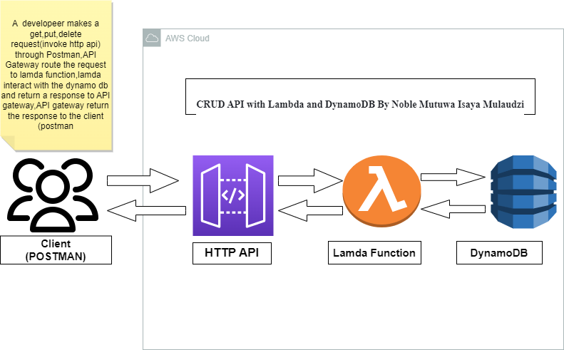

# Rest-API-using-Lamda-and-DynamoDB-with-Serverless-framework by Noble Mulaudzi isaya
 Rest API using Lamda and DynamoDB with Serverless framework

 

 flow

1.Client make request (envokes Http Api ) \
2.API Gateway route the request to the Lamnda function \
3.Lamda function interact with the Dynamo DB \
4.DynamoDB return the response to API Gateway \
5.API Gateway return the response back to the client(Postman)
